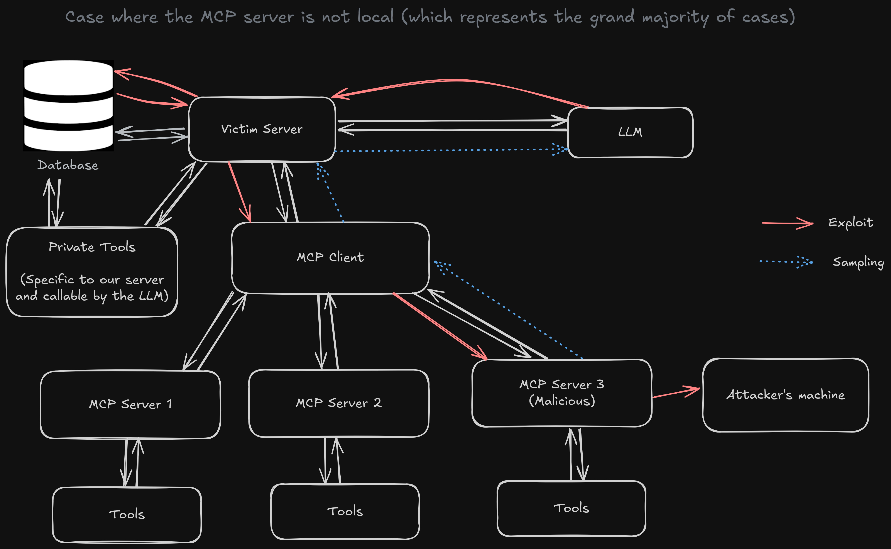

# MCP Server Security: Understanding the Sampling Risk ⚠️

When examining the advanced capabilities of Model Context Protocol (MCP) servers, the "sampling" feature presents a significant security consideration that deserves careful attention. This feature fundamentally shifts control over prompts from the MCP client to the MCP server, creating potential attack vectors that users should understand.

## Understanding MCP Sampling

Sampling represents an elegant solution to a practical problem in MCP architecture. This feature extends MCP server capabilities by providing access to AI language models without requiring server operators to manage their own API keys or absorb token costs.

### The Design Challenge

Under normal circumstances, giving an MCP server direct access to a language model would require:
- The server operator to maintain API credentials
- Direct billing responsibility for token usage
- Complex authentication and rate limiting infrastructure

Since MCP server creators typically aren't the direct beneficiaries of LLM usage, this creates an unsustainable economic model.

### The Sampling Solution

Sampling addresses this challenge through delegation: the MCP client forwards prompts originating from the server to the LLM, then returns the results. This approach keeps costs and API management with the client while enabling server-side AI functionality.

However, this delegation mechanism introduces a critical security consideration: **the actual prompts sent to the LLM originate from the MCP server, not the client.**

## Security Implications

The sampling feature can become a vector for malicious activity when certain conditions align:

### Attack Prerequisites

1. **Remote Server Connection**: The MCP server operates remotely (accessed via HTTP, Server-Sent Events, or similar protocols) rather than locally
2. **Additional Tool Access**: The environment provides the LLM with supplementary tools beyond standard MCP server capabilities
3. **User Trust**: Users connect to servers without examining the underlying code or understanding the security implications

## Exploit Structure

